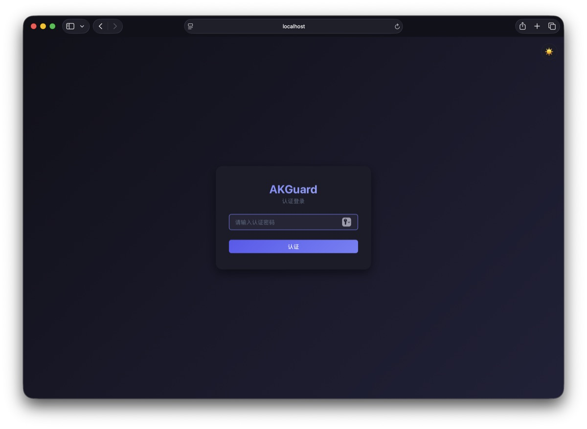
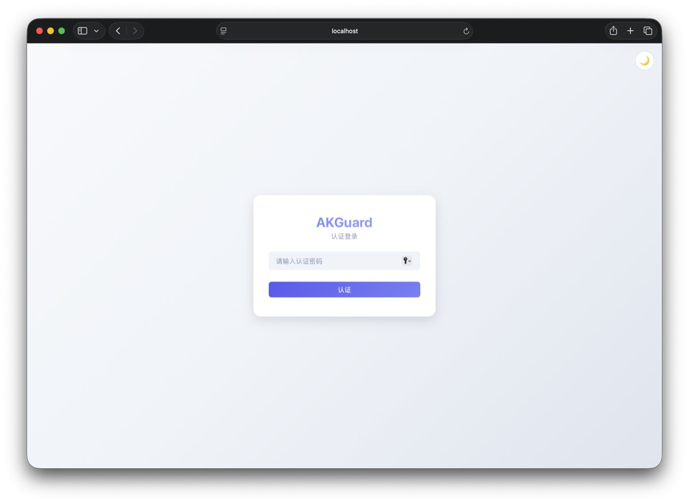
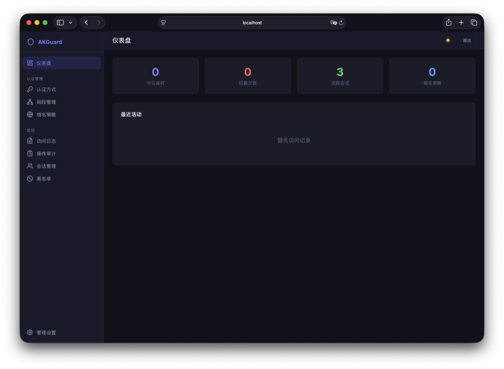
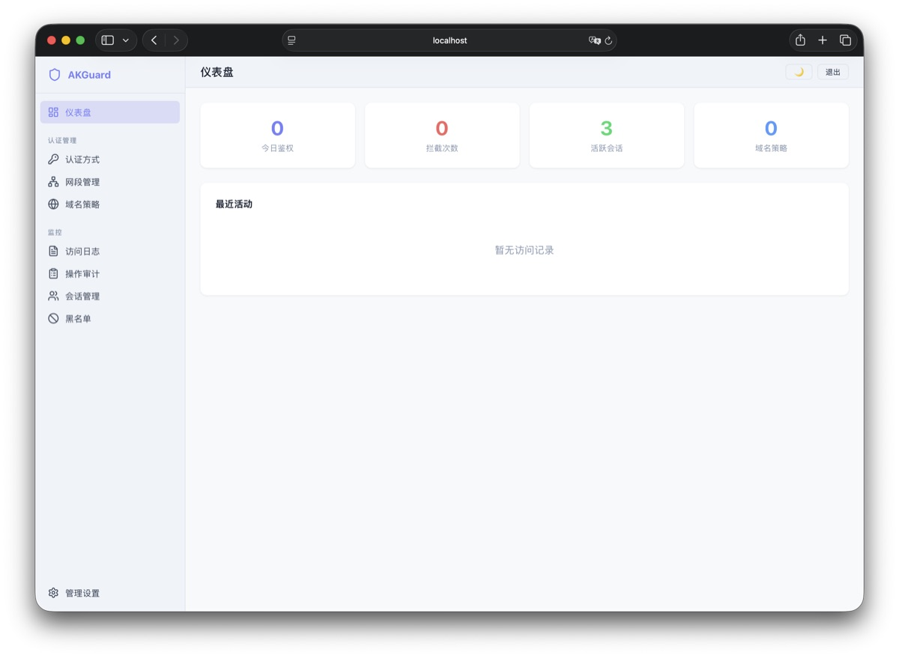
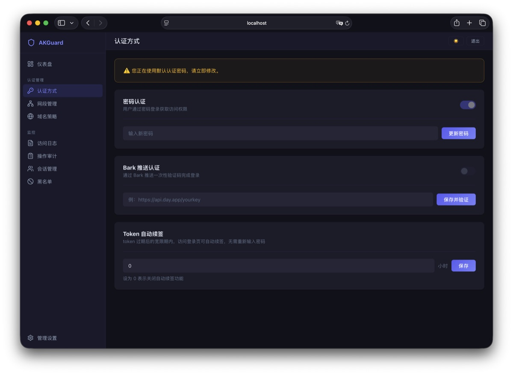
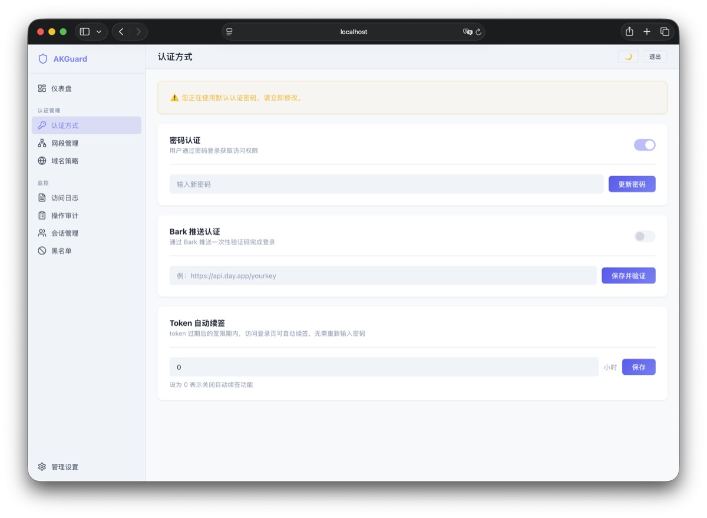
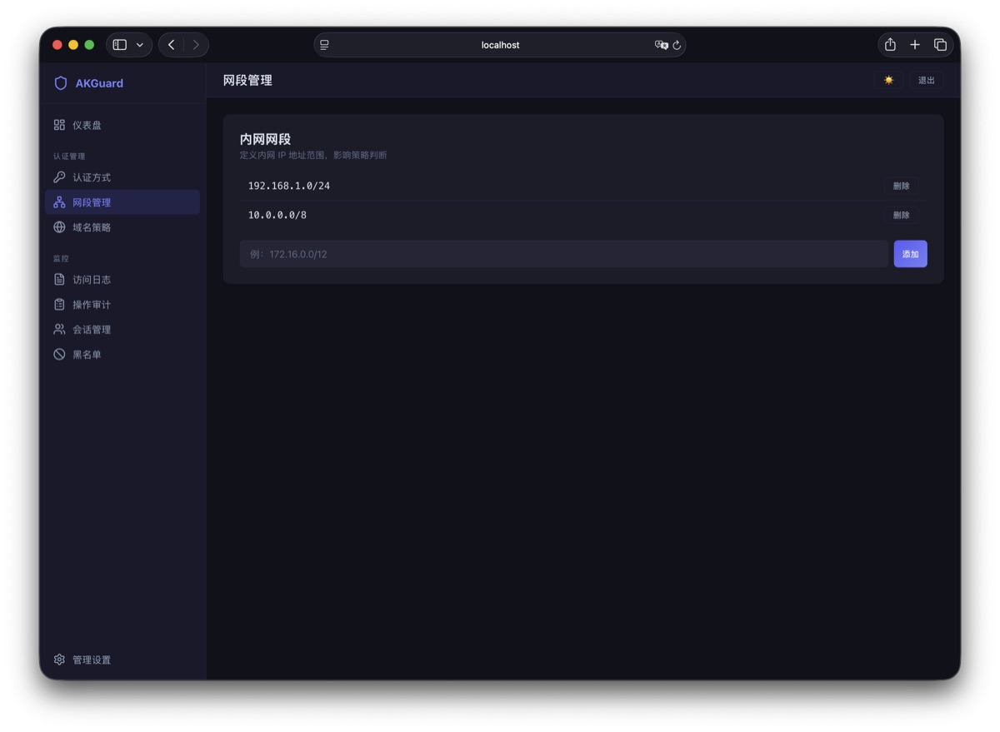
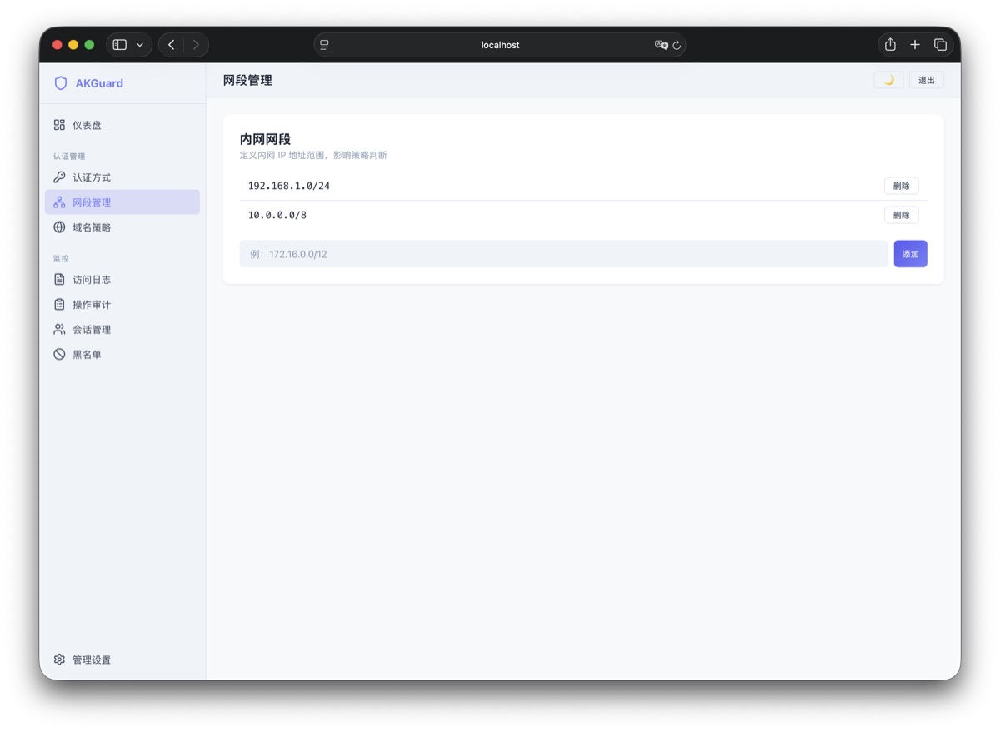
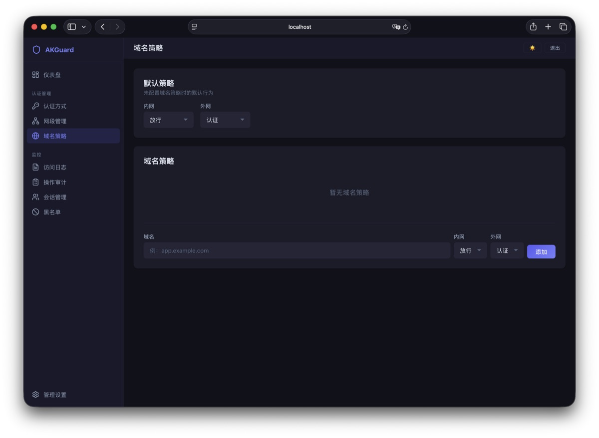
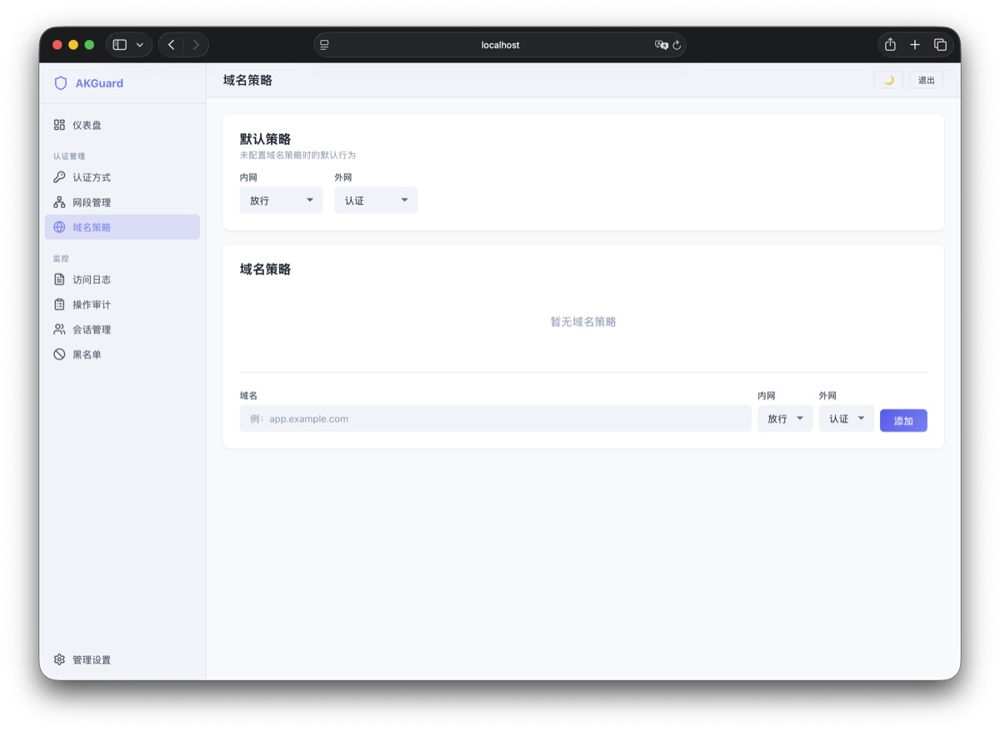

# AKGuard

轻量级认证防御网关，作为 Nginx `auth_request` 后端，为多个子域名提供可配置的访问控制。

## 截图

<table>
  <tr>
    <td align="center">🌙 暗色主题</td>
    <td align="center">☀️ 亮色主题</td>
  </tr>
  <tr>
    <td colspan="2" align="center"><b>登录页</b></td>
  </tr>
  <tr>
    <td></td>
    <td></td>
  </tr>
  <tr><td colspan="2"></td></tr>
  <tr>
    <td colspan="2" align="center"><b>仪表盘</b></td>
  </tr>
  <tr>
    <td></td>
    <td></td>
  </tr>
  <tr><td colspan="2"></td></tr>
  <tr>
    <td colspan="2" align="center"><b>域名配置</b></td>
  </tr>
  <tr>
    <td></td>
    <td></td>
  </tr>
  <tr><td colspan="2"></td></tr>
  <tr>
    <td colspan="2" align="center"><b>黑名单</b></td>
  </tr>
  <tr>
    <td></td>
    <td></td>
  </tr>
  <tr><td colspan="2"></td></tr>
  <tr>
    <td colspan="2" align="center"><b>认证管理</b></td>
  </tr>
  <tr>
    <td></td>
    <td></td>
  </tr>
</table>

## 功能特性

- **策略引擎**：按域名配置放行 / 拒绝 / 认证策略，区分内网外网
- **通配符域名**：支持 `*.example.com` 匹配
- **认证方式**：密码登录 + Bark 推送一次性验证码
- **登录方式管理**：可独立开关密码 / Bark 认证
- **自动封禁**：登录失败达阈值自动封禁 IP（认证 / 管理独立配置）
- **黑名单**：手动封禁 IP，支持永久 / 定时
- **会话管理**：内存 Session + IP 绑定
- **审计日志**：完整操作审计 + 访问日志
- **仪表盘**：访问统计概览
- **可配置标题**：登录页和管理面板标题可自定义
- **暗色 / 亮色主题**：自动检测 + 手动切换
- **SQLite 存储**：零外部依赖，配置持久化

## 快速开始

### 编译

```bash
# 前端
cd frontend && npm install && npm run build && cd ..

# 后端
go build -o akguard .
```

### 运行

```bash
./akguard
```

默认监听 `:3000`，管理面板 `http://localhost:3000/adminlogin`，默认密码 `123456`。

### 环境变量

| 变量 | 说明 | 默认值 |
|------|------|--------|
| `AKGUARD_LISTEN_PORT` | 监听端口 | `3000` |
| `AKGUARD_DB` | 数据库文件路径 | `akguard.db` |
| `AKGUARD_DEV` | 开发模式（CORS） | `0` |

### Docker

使用 Dockerfile 构建并运行：

```bash
# 构建镜像（无论成功或失败都清理残留）
docker build -t akguard:latest . ; docker builder prune -f

# 运行容器（如果已存在同名容器则先删除）
docker rm -f akguard 2>/dev/null ; docker run -d \
  -p 3000:3000 \
  -v akguard-data:/app/data \
  --name akguard \
  akguard:latest
```

或使用 Docker Compose：

```bash
docker compose up -d
```

#### 常用操作

| 操作 | 命令 |
|------|------|
| 查看日志 | `docker logs akguard` |
| 停止容器 | `docker stop akguard` |
| 启动容器 | `docker start akguard` |
| 重启容器 | `docker restart akguard` |
| 删除容器 | `docker rm -f akguard` |
| 删除镜像 | `docker rmi akguard:latest` |

## Nginx 集成

在需要保护的 Nginx server 中配置 `auth_request`：

```nginx
location = /akguard_verify {
    internal;
    proxy_pass http://127.0.0.1:3000/verify;
    proxy_pass_request_body off;
    proxy_set_header Content-Length "";
    proxy_set_header X-Real-IP $remote_addr;
    proxy_set_header Host $host;
    proxy_set_header Cookie $http_cookie;
}

auth_request /akguard_verify;

error_page 401 =302 https://auth.example.com/login?redirect=$scheme://$http_host$request_uri;

proxy_set_header Upgrade $http_upgrade;
proxy_set_header Connection "upgrade";
proxy_set_header X-Forwarded-For $proxy_add_x_forwarded_for;
```

将 `auth.example.com` 替换为你的 AKGuard 实际访问地址。

### Nginx Proxy Manager (NPM)

在 Proxy Host 的 **Advanced** 选项卡中粘贴上述配置。如需多个服务共享，可将配置写入文件后 `include`：

```nginx
include /data/nginx/akguard_protect.conf;
```

## 项目结构

```
├── main.go                    # 入口，路由注册
├── internal/
│   ├── config/                # 配置加载、Session、AttemptTracker
│   ├── handler/               # HTTP handler（认证、配置、日志等）
│   ├── middleware/             # OTP、Bark 推送、Cookie、权限中间件
│   └── model/                 # SQLite 数据层
├── frontend/
│   └── src/
│       ├── api/               # API 封装
│       ├── components/        # 公共组件
│       ├── composables/       # Vue composables
│       ├── views/             # 页面
│       └── router/            # 路由配置
├── Dockerfile
└── docker-compose.yml
```

## 技术栈

- **后端**：Go 1.25、SQLite（modernc.org/sqlite）、bcrypt
- **前端**：Vue 3、Vue Router、Vite
- **部署**：Docker 多阶段构建

## License

MIT
